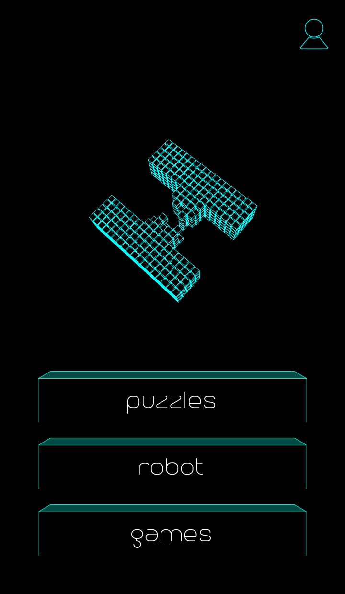
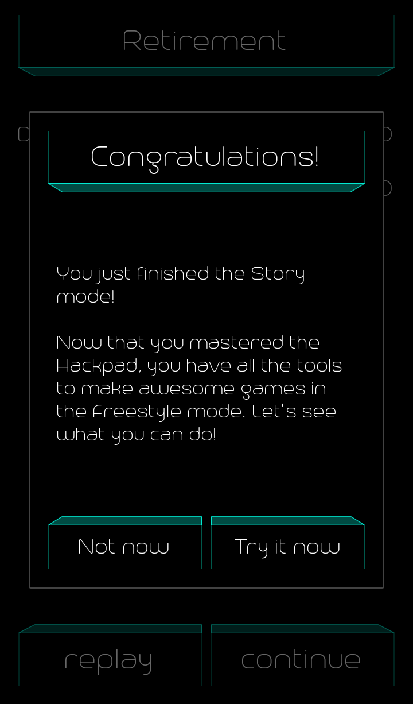

# hacked

Download game from [Google Play Store](https://play.google.com/store/apps/details?id=com.hackedapp&hl=en_US "Google Play")

<tt>Description on play store:</tt>
 
Are you a developer? Do you like coding? Then you're going to love Hacked.

The game can be played in three very different modes :

* Puzzles

    In the story mode, you play the role of a hacker where you need to solve code problems to save the world.
    Once you're done, there's more puzzle packs waiting for you!

* Robot (experimental mode)

    Code the AI of a robot.

* Games

    The game mode is the most versatile mode, in this mode, you can create your own game, publish it, and play other hackers' games!

Hacked is not for everyone, some coding knowledge is required to enjoy the game.

If you think you have what it takes, join the fun and #gethackin !
