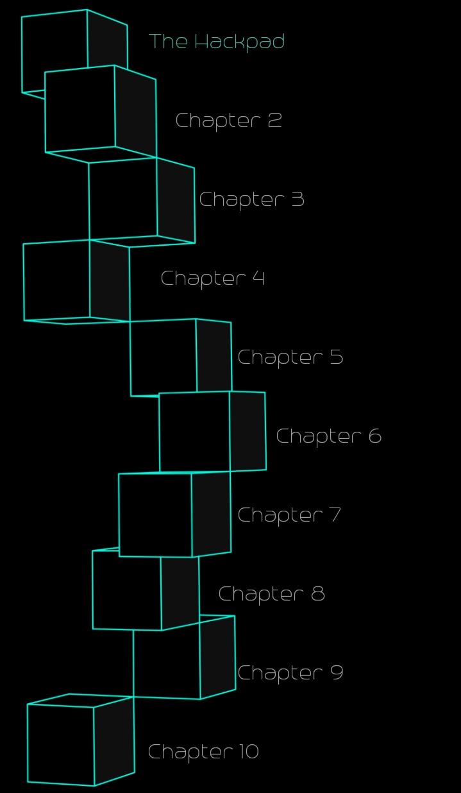
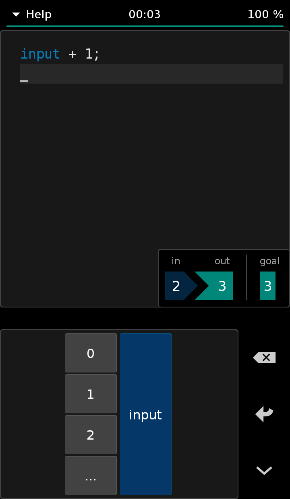
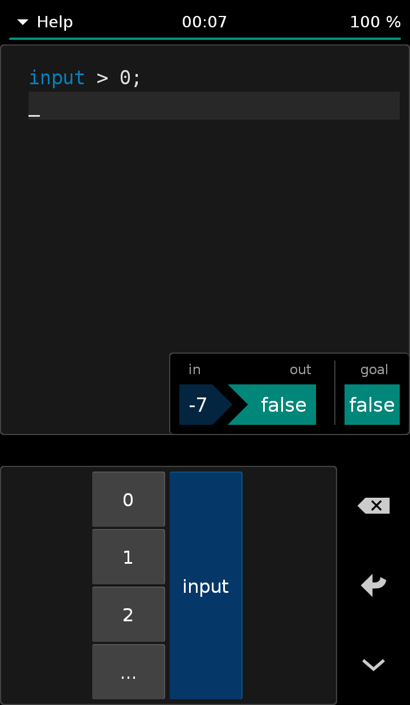
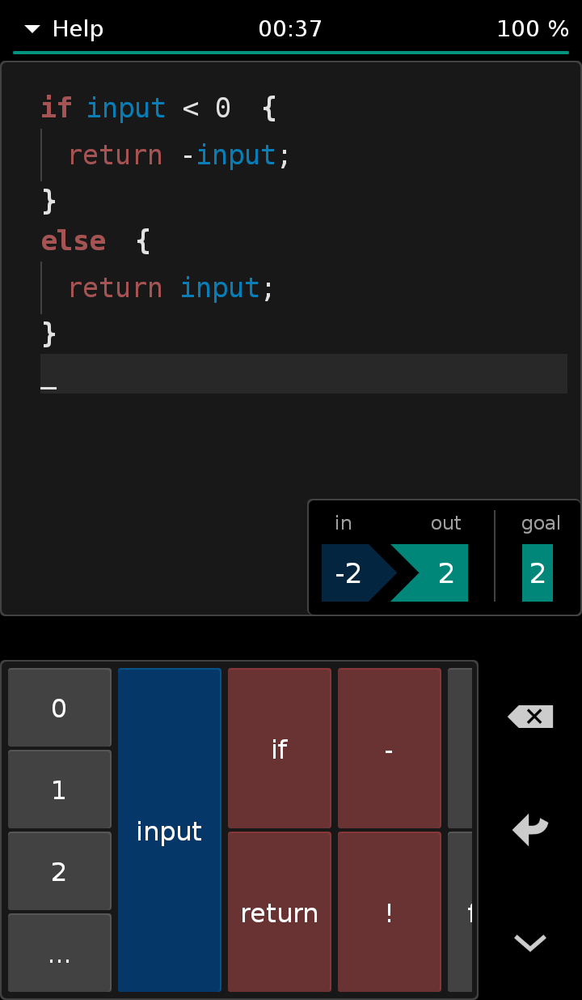
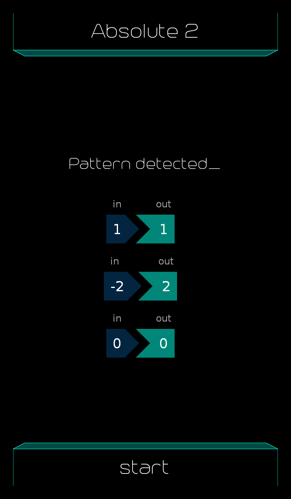
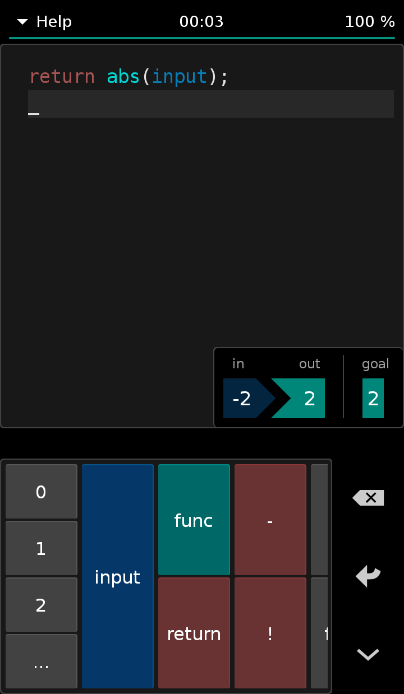

## The Hackpad

<table border=0 align="center">
    <tr>
        <td align="center" valign="middle">
            
        </td>
        <td align="center" valign="middle">
            
        </td>
    </tr>
    <tr>
        <td align="center" valign="middle" colspan=2>
            <h3>1. Increment Me</h3>
        </td>
    </tr>
    <tr>
        <td align="center" valign="middle">
                <h5>Aim</h5>
                
        </td>
        <td align="center" valign="middle">
                <h5>Code</h5>
                
        </td>
    </tr>
    <tr>
        <td align="center" valign="middle" colspan=2>
            <h3>2. Positive</h3>
        </td>
    </tr>
    <tr>
        <td align="center" valign="middle">
                <h5>Aim</h5>
                
        </td>
        <td align="center" valign="middle">
                <h5>Code</h5>
                
        </td>
    </tr>
    <tr>
        <td align="center" valign="middle" colspan=2>
            <h3>3. Absolute</h3>
        </td>
    </tr>
    <tr>
        <td align="center" valign="middle">
                <h5>Aim</h5>
                
        </td>
        <td align="center" valign="middle">
                <h5>Code</h5>
                
        </td>
    </tr>
    <tr>
        <td align="center" valign="middle" colspan=2>
            <h3>4. Absolute 2</h3>
        </td>
    </tr>
    <tr>
        <td align="center" valign="middle">
                <h5>Aim</h5>
                
        </td>
        <td align="center" valign="middle">
                <h5>Code</h5>
                
        </td>
    </tr>
</table>
