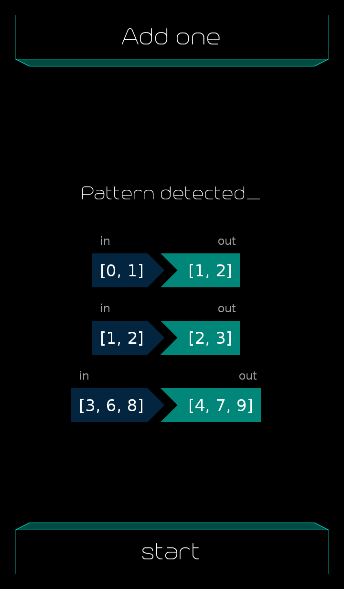
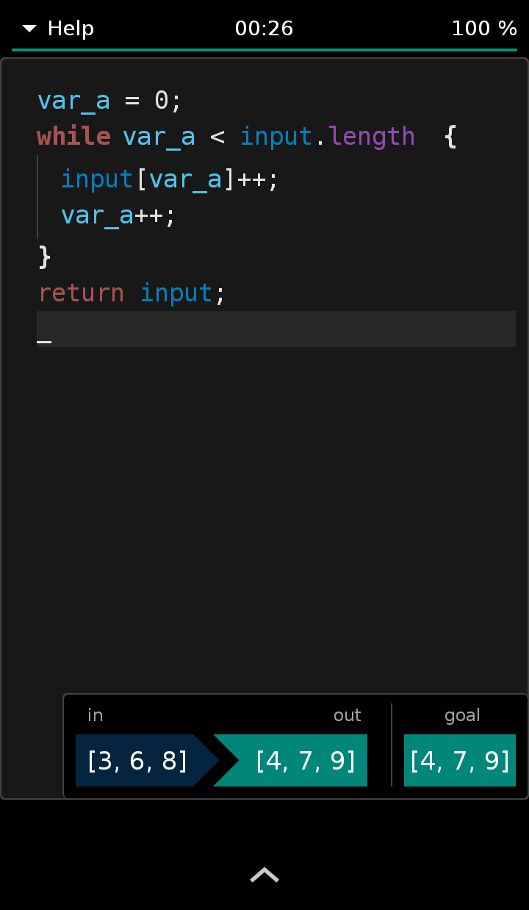
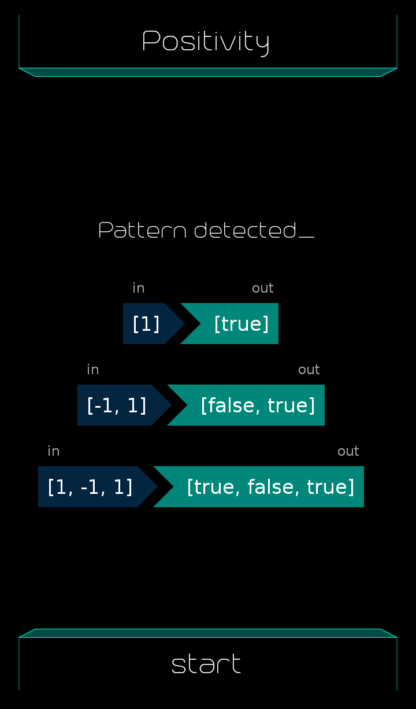
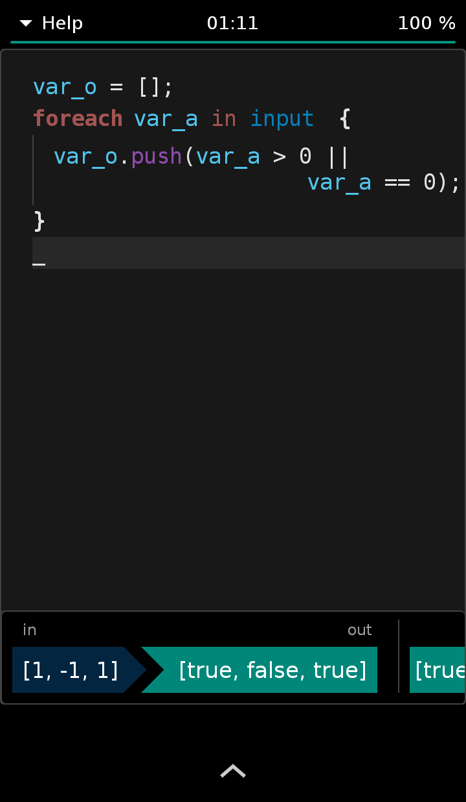

## Nuclear Plant

<table border=0 align="center">
    <tr>
        <td align="center" valign="middle">
            
        </td>
        <td align="center" valign="middle">
            
        </td>
    </tr>
    <tr>
        <td align="center" valign="middle" colspan=2>
            <h3>1. Add One</h3>
        </td>
    </tr>
    <tr>
        <td align="center" valign="middle">
                <h5>Aim</h5>
                
        </td>
        <td align="center" valign="middle">
                <h5>Code</h5>
                
        </td>
    </tr>
    <tr>
        <td align="center" valign="middle" colspan=2>
            <h3>2. Positivity</h3>
        </td>
    </tr>
    <tr>
        <td align="center" valign="middle">
                <h5>Aim</h5>
                
        </td>
        <td align="center" valign="middle">
                <h5>Code</h5>
                
        </td>
    </tr>
</table>
