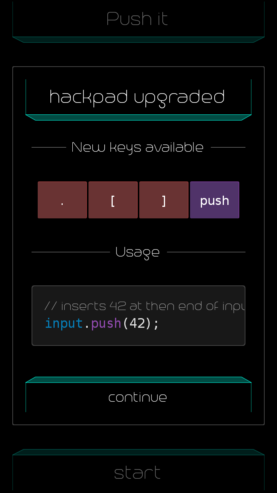
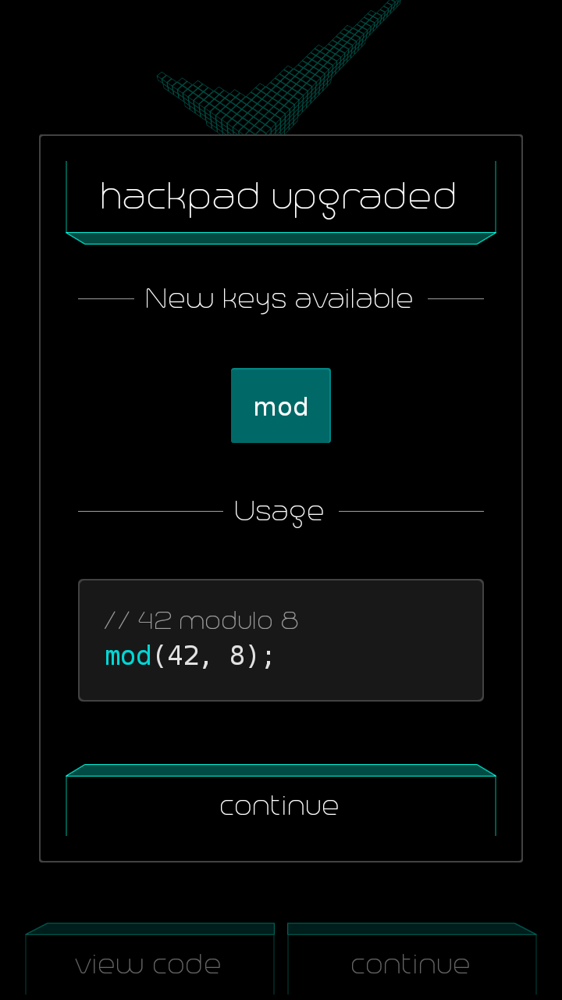

<table border=0>
    <tr>
        <td align="center" valign="middle">  </td>
        <td align="center" valign="middle">  </td>
        <td align="center" valign="middle">  </td>
    </tr>
    <tr>
        <td align="center" valign="middle">  </td>
        <td align="center" valign="middle">  </td>
        <td align="center" valign="middle">  </td>
    </tr>
    <tr>
        <td align="center" valign="middle">  </td>
        <td align="center" valign="middle">  </td>
        <td align="center" valign="middle">  </td>
    </tr>
    <tr>
        <td align="center" valign="middle">  </td>
        <td align="center" valign="middle">  </td>
        <td align="center" valign="middle">  </td>
    </tr>
    <tr>
        <td align="center" valign="middle">  </td>
        <td align="center" valign="middle">  </td>
        <td align="center" valign="middle">  </td>
    </tr>
    <tr>
        <td align="center" valign="middle">  </td>
        <td align="center" valign="middle">  </td>
        <td align="center" valign="middle">  </td>
    </tr>
    <tr>
        <td align="center" valign="middle">  </td>
        <td align="center" valign="middle">  </td>
        <td align="center" valign="middle">  </td>
    </tr>
    <tr>
        <td align="center" valign="middle">  </td>
        <td align="center" valign="middle">  </td>
        <td align="center" valign="middle">  </td>
    </tr>
    <tr>
        <td align="center" valign="middle">  </td>
        <td align="center" valign="middle">  </td>
    </tr>
</table>
