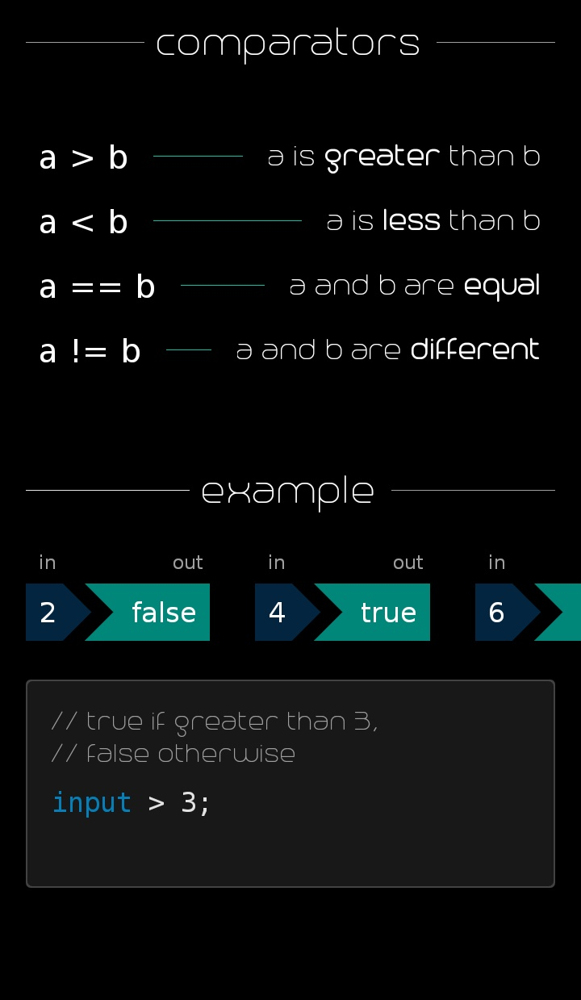

<table border=0>
  <tr>
    <td align="center" valign="middle">  </td>
    <td align="center" valign="middle">  </td>
    <td align="center" valign="middle">  </td>
  </tr>
  <tr>
    <td align="center" valign="middle">  </td>
    <td align="center" valign="middle">  </td>
    <td align="center" valign="middle">  </td>
  </tr>
</table>
